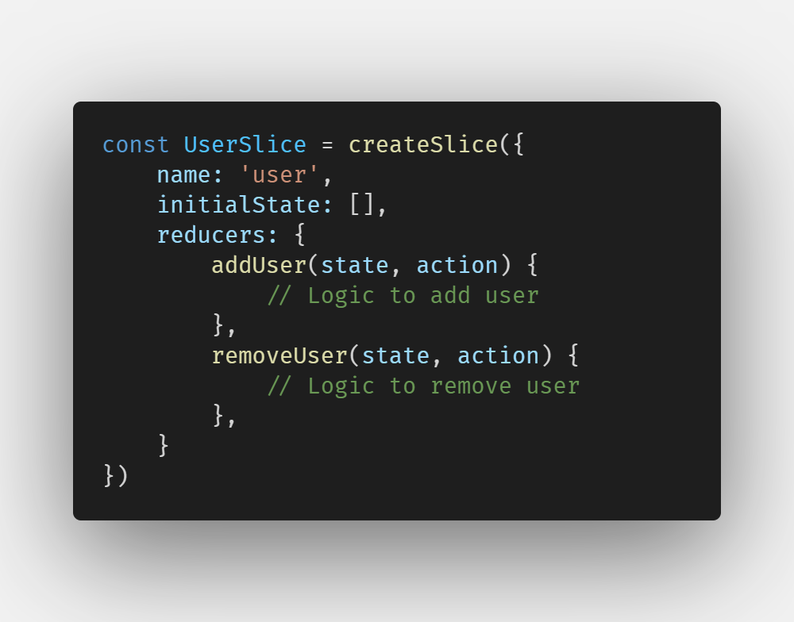

# Redux Tool Kit (RTK)

## How does it benefits us?

Reduces the boilerplate as follows


## Create Slices  
### Slices - Semantic groups of data manipulating a common subset of redux store/state.  
createSlice takes 3 args - name, initialState, reducers  
- name: name of the slice
- initialState: The initial value of state
- reducers: contains micro reducers & automatically generates actionTypes for us  



## Create Store
Single source of truth
- All slices created === Redux store
- created with configureStore

- reducer is a root reducer for the store if there is 1 slice and combineReducer if multiple slices 

```
const store = configureStore({
    reducer: {
        nameOfSlice: sliceFromCreateSlice.reducer,
    }     // Contains all slices' reducers
});
```
OR

```
createSlice...
export default name.reducer;

const store = configureStore({
    reducer: {
        nameOfSlice: createdSlice,
    }     // Contains all slices' reducers
});
```

## Connecting React to Redux store
- <Provider> from React-redux
- Pass store to the Provider.

## Update state data
```
const data = () => {
    console.log(`Do some work here`);
    // Do additional work here and return the modified values.
    const calculatedData = 'Hello';
    return calculatedData;
}

const addUser = (payload) => {
    console.log(payload);
}

// Here addUser's payload = hello
<button onClick={() => addUser(data())}>Add</button>
```
- By the above logic, we can get data. Now main concern is how to add it to store?

- 2 steps to update store
1. useDispatch hook
2. Action creators

Example for action creators:
```

// initial state goes here
const initialState = {
    items: {
        name: string;
        id: string;
        qty: number;
    }[],
    accessTime: DateTime;
}

const itemSlice = createSlice({
    name: 'item',
    initialState = initialState,
    reducers: {
        addItem(state, action) {
            state.items.push(action.payload)
        },
        removeItem(state, action) {
            
        },
        updateDate(state, action) {
            state.accessTime = action.payload
        }
    }
});

export const {
    addItem,
    removeItem,
    updateDate
} = itemSlice.actions;

// These actions are called using dispatch

const dispatch = useDispatch();
dispatch(addItem(data));
```

It is a good practice to export default slice.reducer and add another export const {} = slice.actions