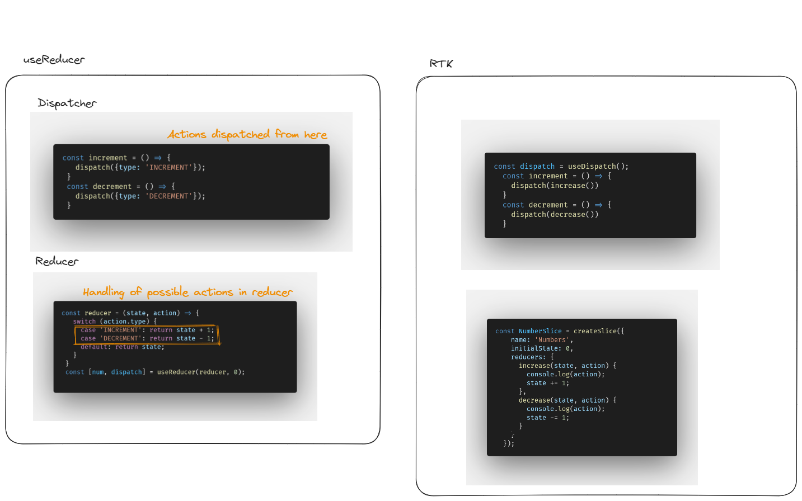

# Redux Tool Kit (RTK)

## How does it benefits us?

Reduces the boilerplate as follows


## Create Slices  
### Slices - Semantic groups of data manipulating a common subset of redux store/state.  
createSlice takes 3 args - name, initialState, reducers  
- name: name of the slice
- initialState: The initial value of state
- reducers: contains micro reducers & automatically generates actionTypes for us  


## Create Store
Single source of truth
- All slices created === Redux store
- created with configureStore

- reducer is a root reducer for the store if there is 1 slice and combineReducer if multiple slices 

```
const store = configureStore({
    reducer: {
        nameOfSlice: sliceFromCreateSlice.reducer,
    }     // Contains all slices' reducers
});
```
OR

```
createSlice...
export default name.reducer;

const store = configureStore({
    reducer: {
        nameOfSlice: createdSlice,
    }     // Contains all slices' reducers
});
```